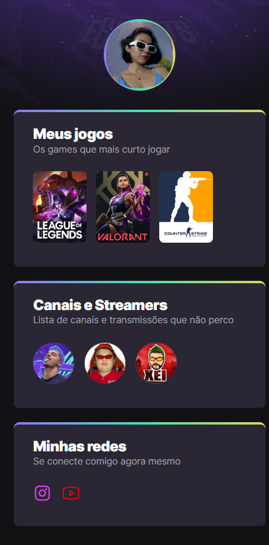

## Nlw eSports - Trilha Explorer
Projeto construído no evento Nextr Level Week da RocketSeat.

## 🔗 Tecnologias
HTML;

CSS;

Git e GitHub;

## 👉 Consideração sobre o projeto
O projeto foi fundamental para ampliar minhas expectativas em relação ao mundo da programação. Ele mostrou que com conhecimentos básicos de HTML/CSS podemos construir projetos úteis e visualmente agradáveis.

[👉 Clique aqui para acessar meu projeto](https://luanafreitasn.github.io/nlw-eSports-explorer/)

## 👨‍💻 Contato
luufreittas@gmail.com
